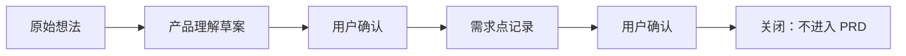

# 09 真实流程演练：AI Factory Intake

## 这次演练证明了什么

这次没有选择一个马上开发的产品功能，而是选择了一个更符合当前阶段的真实想法：

`AI Factory Intake：想法到产品理解入口`

它验证的是 AI 原生软件工厂的第一道生产线：原始想法进入工厂后，不能直接变成 PRD 或开发任务，而要先经过产品理解、人工确认、需求点记录和去向判断。

## 为什么这件事重要

传统项目里，想法经常直接进入开发讨论，导致需求来源不清、上下文丢失、设计和实现脱节。

这个项目把 Intake 作为流程基础设施处理，目的是让每个输入都有来源、有分类、有状态、有下一步判断。对 AI 协作尤其重要，因为 AI 很容易把一次对话里的猜测当成确定事实。

## 本次流程路径

## 已确认的 Intake 分类

| 分类      | 用途                                       |
| --------- | ------------------------------------------ |
| 产品想法  | 产品能力、用户场景、价值主张               |
| 技术想法  | 架构、工具链、运行时、工程能力             |
| 设计想法  | UI、体验、信息架构、设计系统               |
| 流程改进  | 工作流、Playbook、Prompt、Memory、同步规则 |
| 外部引用  | 文章、截图、文档、访谈材料                 |
| 竞品观察  | 竞品能力、竞品流程、竞品体验、市场表达     |
| 用户反馈  | 用户需求、抱怨、访谈反馈、使用过程中的信号 |
| 风险/问题 | 缺陷、矛盾、未知风险、流程不稳定点         |

## 人工决策

- 需求陈述正确。
- Intake 分类需要包含 `竞品观察` 和 `用户反馈`。
- 该需求不进入 PRD 候选池。
- 当前只作为 AI 工厂流程基础设施沉淀。

## 补充流程规则

流程不按“对话次数”划分，而按“目标连续性”划分。

一个想法从 Intake 到产品理解、需求、PRD、设计 brief、UI 设计图和工程规格，属于同一个主流程生命周期。中间的补充、修正、评审和设计调试，都应记录为同一流程的 revision 或状态轨迹。

只有目标改变、范围结构性扩大、产生独立子方向，或已关闭流程重新启动时，才创建新流程或子流程。子流程必须链接回主流程。

## 产生的仓库资产

- `ai-factory/specs/product-understanding/2026-05-18-ai-factory-intake-product-understanding.md`
- `ai-factory/specs/requirements/2026-05-18-ai-factory-intake-requirements.md`
- `ai-factory/workflows/runs/2026-05-18-idea-to-product-understanding-ai-factory-intake.md`
- `ai-factory/workflows/runs/2026-05-18-requirement-capture-ai-factory-intake.md`

## 面试时可以怎么讲

这不是一个普通的“需求文档目录”，而是一套可执行的 AI 协作流程。

我没有让 AI 直接写 PRD 或开发功能，而是先建立了 Intake、产品理解、人工确认和需求记录之间的链路。这个链路保证后续 PRD、UI 设计和工程实现都有可追溯来源，也能避免 AI 把临时想法误写成长期事实。

## 下一步

继续用真实输入验证流程，优先选择更接近产品方向的材料：

- 用户画像
- 目标使用场景
- 竞品观察
- 外部文章或截图
- 设计风格参考

等这些输入能稳定走完 Intake 到产品理解，再进入 Phase 1.2 的 PRD 和设计图生成。
