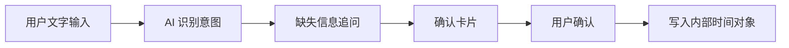

# 10 AI 时间管理 Agent：产品方向与需求基线

## 当前阶段

项目已经完成第一个正式产品方向的产品理解和需求捕获。

这个产品暂名为：

`AI 时间管理 Agent`

它不是普通的 AI 日程录入工具，而是一个通过对话帮助用户管理日程、待办和提醒的个人时间管理 Agent。

## 为什么选择这个方向

传统日历工具主要依赖用户手动录入和维护。单纯用 AI 创建日程，价值仍然偏薄。

本项目选择更长期的方向：让 AI 成为时间管理入口。用户可以用自然语言表达安排、待办、提醒或计划意图，AI 负责理解、追问、确认和执行。

这让产品具备后续扩展空间：

- 个人日程管理
- 待办和提醒管理
- 每日计划建议
- 会议准备
- 时间冲突识别
- 外部日历与工具连接器

## 第一版产品边界

第一版不追求完整时间管理平台，而是先跑通一个可验证闭环：

第一版内部时间对象包括：

| 类型 | 说明                                                   |
| ---- | ------------------------------------------------------ |
| 日程 | 有明确日期和开始时间，可包含结束时间、地点、备注和提醒 |
| 待办 | 有目标描述，可包含截止时间、优先级、备注和状态         |
| 提醒 | 有提醒时间和提醒内容                                   |

## 关键产品规则

- 用户通过文字对话创建、查询、修改和取消事项。
- AI 采用规则 + LLM 混合策略。
- 信息不足时，AI 必须追问。
- 创建、修改、取消前必须展示确认卡片。
- 用户确认后才允许写入内部时间对象。
- 第一版不做语音输入。
- 第一版不做完整账号体系。
- 第一版不接手机系统日历、飞书会议或 Things3。

## Hybrid 架构边界

产品采用原生壳子 + H5 产品层。

| 层级             | 职责                                                    |
| ---------------- | ------------------------------------------------------- |
| Native Shell     | 稳定容器、安全区、权限、通知、本地能力、未来系统桥接    |
| H5 Product Layer | 工作台、AI 对话、确认卡片、日程/待办/提醒视图和产品流程 |
| Bridge Contract  | Native 与 H5 之间的显式通信契约                         |

这个边界的目的，是避免业务 UI 和产品流程散落在原生与 H5 两端。原生层保持稳定，H5 层承载高频产品迭代。

## 已确认需求基线

第一版 P0 需求包括：

- 文字对话入口
- 日程 / 待办 / 提醒三类内部时间对象
- AI 意图识别与结构化 action
- 缺失信息追问
- 执行前确认卡片
- App 内部闭环
- Native 稳定壳 + H5 产品层
- 显式 Bridge Contract
- 本地优先 + 关键结构同步后端
- 外部连接器预留

## 面试讲解重点

这个阶段体现的不是“我已经开始写功能”，而是“我没有急着写功能”。

我先用 AI 工厂流程把产品想法转成产品理解，再转成需求点记录，并在每个关键节点等待人工确认。这样做可以避免 AI 把模糊想法直接变成开发任务，也能保证后续 PRD、设计图和工程实现都有来源。

该产品方向目前已经进入 Phase 1.2 PRD 候选，下一步会生成 PRD 草案和设计 brief。

## 仓库证据

- `ai-factory/specs/intake/2026-05-18-ai-time-management-agent.md`
- `ai-factory/specs/product-understanding/2026-05-18-ai-time-management-agent-product-understanding.md`
- `ai-factory/specs/requirements/2026-05-18-ai-time-management-agent-requirements.md`
- `ai-factory/workflows/runs/2026-05-18-idea-to-product-understanding-ai-time-management-agent.md`
- `ai-factory/workflows/runs/2026-05-18-requirement-capture-ai-time-management-agent.md`
