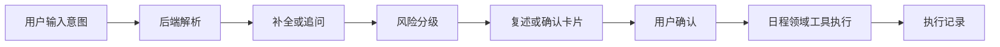

# 10 AI 时间管理 Agent：产品方向与需求基线

## 当前阶段

项目已经完成第一个正式产品方向的产品理解和需求捕获。

这个产品暂名为：

`AI 时间管理 Agent`

2026-05-19 经过 UI 评审和参考产品分析后，方向进一步收敛为：

`AI 日程执行 Agent`

它不是普通的 AI 日程录入工具，也不是“日历工作台 + AI 输入框”。它的核心价值是让用户只输入意图，后端 AI 负责理解、补全、规划、确认、执行和记录。日历、Timeline 和执行记录都是辅助用户检查与建立信任的界面。

## 为什么选择这个方向

传统日历工具主要依赖用户手动录入和维护。单纯用 AI 创建日程，价值仍然偏薄。

本项目选择更长期的方向：让 AI 成为时间管理入口。用户可以用自然语言表达安排、调整、删除、查询或计划意图，AI 负责理解、追问、确认和执行。

这让产品具备后续扩展空间：

- 个人日程管理
- 待办和提醒管理
- 每日计划建议
- 会议准备
- 时间冲突识别
- 外部日历与工具连接器
- 费用管理等跨领域协同

## 第一版产品边界

第一版不追求完整时间管理平台，而是先跑通“日程管理领域”的可验证闭环：

第一版优先支持日程管理领域：

| 能力     | 第一版定位                               |
| -------- | ---------------------------------------- |
| 创建日程 | 必做，支持单项和批量创建                 |
| 查询日程 | 必做，支持今天、本周、特定日期和空闲时间 |
| 修改日程 | 必做，由后端定位目标对象并复述修改计划   |
| 删除日程 | 必做，单项可确认执行，批量必须结构化确认 |
| 清空日程 | 必做，高风险操作，必须列出影响范围后确认 |
| 智能安排 | 轻量支持，只在明确范围内查找可用空档     |
| 待办提醒 | 后置，不作为 V1 主域                     |
| 费用管理 | 只做 DDD 架构预留，不进入 V1             |

## 关键产品规则

- 用户通过文字或语音式输入表达意图，V1 工程可以先用文字承载。
- 前端不解析业务语义，不做日程编排。
- 后端负责意图识别、日期时间解析、信息补全、计划生成、风险分级和工具执行。
- 低风险查询可以直接返回结果。
- 中风险单项写入必须复述并等待确认。
- 高风险批量操作必须展示结构化确认卡片。
- 用户可以点击确认，也可以回复自然语言确认。
- 第一版不做完整账号体系。
- 第一版不接手机系统日历、飞书会议或 Things3。
- 第一版不做费用管理，只保留未来 DDD 领域边界。

## 执行风险分级

| 风险等级 | 典型动作                     | 交互要求                         |
| -------- | ---------------------------- | -------------------------------- |
| 低风险   | 查询今天安排、查找空闲时间   | 直接返回结果                     |
| 中风险   | 创建单个日程、修改单项日程   | 复述结构化信息，用户确认后执行   |
| 高风险   | 批量创建、批量删除、清空日程 | 展示结构化确认卡片，列出影响范围 |

## UI 主路径修订

首页默认不是日历视图，而是 AI 执行流。

界面由四个稳定区域组成：

- 主区域：AI 执行流，承载输入、分析、追问、确认、执行结果。
- 左侧：Timeline Drawer，参考 Timepage，以日期轴展示今天 + 未来 7 天。
- 右上：执行记录，展示 AI 最近做了什么。
- 右上：完整日历，作为结果检查工具，不是主要创建入口。

实时执行状态固定在输入框上方，避免对话滚动后用户看不到系统当前状态。

## Hybrid 架构边界

产品采用原生壳子 + H5 产品层。

| 层级             | 职责                                                    |
| ---------------- | ------------------------------------------------------- |
| Native Shell     | 稳定容器、安全区、权限、通知、本地能力、未来系统桥接    |
| H5 Product Layer | 工作台、AI 对话、确认卡片、日程/待办/提醒视图和产品流程 |
| Bridge Contract  | Native 与 H5 之间的显式通信契约                         |

这个边界的目的，是避免业务 UI 和产品流程散落在原生与 H5 两端。原生层保持稳定，H5 层承载高频产品迭代。

## 已确认需求基线

第一版 P0 需求已经修订为：

- AI 执行流主入口
- 日程管理领域闭环
- 后端意图解析与结构化计划
- 缺失信息追问
- 低/中/高风险确认策略
- 执行状态固定展示
- 执行记录审计
- Timepage 风格 Timeline Drawer
- App 内部闭环
- Native 稳定壳 + H5 产品层
- 显式 Bridge Contract
- 后端 Orchestrator + 日程领域工具边界
- 外部连接器预留

## 面试讲解重点

这个阶段体现的不是“我已经开始写功能”，而是“我在发现 UI 不满意后，没有只改样式，而是回到产品主路径重新校准需求”。

参考产品给到的启发是：AI 时间管理的重点不是表单录入，而是计划与执行流水线。真正有价值的是后端能理解用户意图、补全缺失信息、生成计划、判断风险、调用工具并留下执行记录。

这让项目从“AI 日程录入工具”升级为“AI 日程执行 Agent”。下一步应先重画 Figma，而不是进入产品开发。

## 仓库证据

- `ai-factory/specs/intake/2026-05-18-ai-time-management-agent.md`
- `ai-factory/specs/product-understanding/2026-05-18-ai-time-management-agent-product-understanding.md`
- `ai-factory/specs/requirements/2026-05-18-ai-time-management-agent-requirements.md`
- `ai-factory/specs/requirements/2026-05-19-ai-time-management-agent-execution-workbench-revision.md`
- `ai-factory/specs/design/2026-05-19-ai-time-management-agent-ui-revision.md`
- `ai-factory/workflows/runs/2026-05-18-idea-to-product-understanding-ai-time-management-agent.md`
- `ai-factory/workflows/runs/2026-05-18-requirement-capture-ai-time-management-agent.md`
- `ai-factory/workflows/runs/2026-05-19-ai-time-management-agent-requirement-ui-revision.md`
