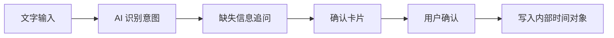

# 11 AI 时间管理 Agent：PRD 草案

## 当前阶段

AI 时间管理 Agent 已从需求基线进入 PRD 草案阶段。

这一步仍然不是产品开发，而是把已确认需求转成可审阅的产品需求文档，为后续 design brief、UI 设计图和工程规格提供输入。

## 产品定位

AI 时间管理 Agent 是一个以工作台和 AI 对话为核心的个人时间管理 App。

第一版重点不是做完整时间管理平台，而是跑通一个可信闭环：



## 第一版范围

第一版 P0 能力包括：

- 文字 AI 输入
- 日程、待办、提醒三类内部时间对象
- 创建日程、创建待办、创建提醒
- 查询今日安排和本周安排
- 修改已创建事项
- 取消已创建事项
- 缺失信息追问
- 执行前确认卡片
- App 内部日历、待办、提醒闭环
- 本地优先 + 关键结构同步后端的数据策略
- Native/H5 显式 Bridge Contract 边界

## 明确不做

- 不直接进入产品功能开发
- 不在第一版实现完整账号体系
- 不在第一版支持语音输入
- 不在第一版接入手机系统日历
- 不在第一版接入飞书会议、Things3 或其他外部工具
- 不在第一版实现复杂多端冲突合并
- 不让原生层承担高频变化的业务 UI

## Hybrid 边界

| 层级             | 职责                                                     |
| ---------------- | -------------------------------------------------------- |
| Native Shell     | WebView 容器、安全区、权限、通知、本地能力、未来系统桥接 |
| H5 Product Layer | 工作台、AI 对话、确认卡片、日程/待办/提醒视图            |
| Bridge Contract  | 约束 H5 调用 Native 能力的方式                           |

这个边界保证原生层低频变化，H5 层承载高频产品迭代。

## PRD 当前待确认问题

- 第一版云端同步是否必须真实可用，还是只需保留契约和字段。
- 待办缺少截止时间时，是直接创建无截止待办，还是必须追问。
- 日程缺少结束时间时，默认时长是多少。
- 提醒中的模糊时间，例如“明天下午”，应如何映射或追问。
- 确认卡片是否允许直接编辑字段。
- 取消事项是删除，还是标记为 canceled。
- 工作台首页是否同时展示日程、待办、提醒和 AI 输入。
- 后端是否保存完整对话，还是只保存结构化 action 和摘要。

## 面试讲解重点

这个阶段体现的是 AI 工厂的产品资产生产能力。

我不是直接让 AI 写代码，而是让一个产品想法按流程经过：

```text
Intake
-> 产品理解
-> 需求点记录
-> PRD 草案
```

每一步都保留来源、确认状态、运行记录和下一步边界。这说明项目不是单纯搭了一个前后端模板，而是在构建一套可以持续生产产品需求、设计和工程规格的 AI-native software factory。

## 仓库证据

- `ai-factory/specs/prd/2026-05-18-ai-time-management-agent-prd-draft.md`
- `ai-factory/workflows/prd-draft.md`
- `ai-factory/workflows/registries/prd-draft.manifest.json`
- `ai-factory/workflows/runs/2026-05-18-prd-draft-ai-time-management-agent.md`
