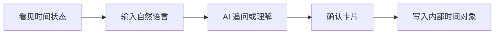

# 12 AI 时间管理 Agent：Design Brief 草案

## 当前阶段

AI 时间管理 Agent 已从 PRD 草案进入 design brief 阶段。

这一步的目标不是直接画最终 UI，而是把 PRD 转成可指导 UI 设计图的设计输入，包括页面目标、信息优先级、状态、组件层级和 Hybrid 约束。

## 体验目标

第一版设计要让用户在一个工作台里完成个人时间管理闭环：

设计方向不是纯聊天页，也不是传统日历首页，而是一个以 AI 为入口、以时间对象为结果的工作台。

## 信息优先级

1. 当前最需要用户处理的事项：确认卡片、追问、同步失败、即将开始的日程。
2. AI 输入入口：始终可见或一键可达。
3. 今日时间状态：下一项日程、未完成待办、即将提醒。
4. 时间收件箱：待补充、待确认、待分类的输入。
5. 日程 / 待办 / 提醒列表。
6. 外部连接器入口：后续版本保留，不作为第一版主视觉。

## 核心视图

- 工作台首页
- AI 对话区
- 确认卡片
- 日程视图
- 待办视图
- 提醒视图

## 设计默认决策

- 日程缺少结束时间时，默认时长为 60 分钟，并在确认卡片展示。
- 待办缺少截止时间时，允许创建无截止时间待办。
- 提醒缺少明确时间时，必须追问。
- 取消事项默认标记为 `canceled`，不直接永久删除。
- 后端第一版保存结构化 action 和摘要，不默认保存完整对话。
- 工作台首页不同时展开完整日程、待办、提醒和聊天记录。

这些是设计草案默认值，仍需要用户确认。

## Hybrid 设计约束

- 原生层只提供稳定容器和设备能力，不承载高频变化业务 UI。
- H5 控制工作台、对话、确认卡片和时间对象视图。
- H5 调用原生能力必须通过 Bridge Contract。
- UI 不应依赖原生固定底部导航。
- 安全区、通知授权、本地能力和未来系统日历桥接应在设计中留出入口或状态。

## 面试讲解重点

这个阶段展示的是从 PRD 到设计输入的转换能力。

我没有直接让 AI 画一个看起来不错的页面，而是先把体验目标、信息层级、状态覆盖、组件层级和 Hybrid 边界整理成 design brief。这样后续 UI 图不会只是视觉草图，而是能追溯到产品需求和工程边界的设计资产。

## 仓库证据

- `ai-factory/specs/design/2026-05-18-ai-time-management-agent-design-brief.md`
- `ai-factory/workflows/design-brief-draft.md`
- `ai-factory/workflows/registries/design-brief-draft.manifest.json`
- `ai-factory/workflows/runs/2026-05-18-design-brief-draft-ai-time-management-agent.md`
