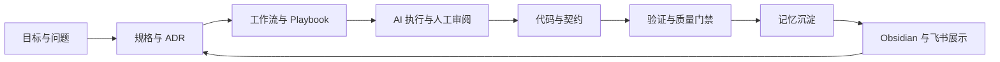

# AI 工厂流程审计报告

## 基线

- 审计日期：2026-05-18
- 基线 tag：`v0.1.0-skeleton`
- 基线提交：`e38ae06 docs(knowledge): 建立飞书展示知识库源稿`
- 当前判断：项目已经具备 AI 原生软件工厂的雏形，但流程资产还不够稳定，暂不适合马上进入大量功能开发。

## 结论

当前仓库的强项是边界清晰、原则明确、第一条端到端薄切片已经跑通。弱项是 AI factory 的内容密度不足，很多目录仍停留在 README 占位层；工作流只有一条真实流程，且缺少运行前 intake、运行中检查、运行后复盘和记忆提升的统一机制。

下一阶段不应优先扩展产品功能，而应先做“流程打磨迭代”：把规格、记忆、提示词、工作流、设计系统、契约、质量门禁和知识同步全部过一遍，形成可重复执行的作战方式。

## 流程地图

这张图里最薄弱的环节是 `工作流与 Playbook`、`AI 执行与人工审阅`、`记忆沉淀`。目前它们有目录、有原则，但缺少足够可执行的模板和检查清单。

## 流程分块审计

### 1. 项目治理与基线管理

当前状态：

- 已有中文文档、中文 Conventional Commits、ADR、反模式、演进规则。
- 已打 tag `v0.1.0-skeleton`，可作为“雏形基线”。
- GitHub、Obsidian、飞书已经形成三层证据链。

问题：

- 还没有“阶段门禁”定义：什么时候可以从流程优化进入功能开发，什么时候必须回到流程补齐。
- tag 只有当前基线，还没有 release note 或阶段说明模板。
- 变更进入飞书/Obsidian/GitHub 的顺序已有实践，但还没有固化成 checklist。

待完善：

- 建立 `phase-gate` 文档，定义每个阶段的进入条件、退出条件和证据要求。
- 为 tag/release 增加固定说明模板。
- 把“阶段成果记录流程”从 Obsidian 反向沉淀一份仓库版流程。

### 2. 规格、ADR 与意图管理

当前状态：

- `ai-factory/specs/active/factory-status-panel-v1.md` 是第一个较完整规格。
- `docs/adr/0001-polyglot-ai-native-monorepo.md` 记录了多语言 monorepo 的核心决策。
- `docs/conventions/source-of-truth.md` 定义了权威来源。

问题：

- 规格生命周期还不完整：active 到 archived 的条件不清晰。
- ADR 触发条件有原则，但缺少操作清单。
- 规格和 ADR 之间没有显式链接规则。

待完善：

- 增加规格模板，强制包含：背景、目标、非目标、用户体验、数据契约、影响范围、验证方式、记忆更新建议。
- 增加 ADR 提交流程：触发条件、决策备选、影响范围、迁移计划、回滚方式。
- 建立“规格完成后如何归档、如何提升为 durable memory”的流程。

### 3. 记忆系统

当前状态：

- `ai-factory/memory/` 已区分 durable 与 working。
- 已有 `durable/architecture/current-state.md` 和两个 working task 记录。
- `contracts/memory/memory-document.schema.json` 定义了记忆文档的结构意图。

问题：

- 记忆 schema 与 Markdown 记忆文件尚未建立校验关系。
- durable memory 的提升标准仍偏抽象。
- working memory 何时清理、归档或转化为 durable memory 还没有固定流程。
- 记忆访问纪律主要写在文档里，没有 loader、repository 或人工检查清单。

待完善：

- 定义 memory note 模板，统一 `id`、`domain`、`scope`、`title`、`sourcePath`、`tags`。
- 增加“记忆提升评审”流程：哪些事实可进入 durable，哪些只能保留在 working。
- 为每次阶段结束增加 memory review：新增、更新、归档、删除候选。
- 暂不做向量库，但可以先做手动索引文件，列出当前有效记忆。

### 4. Prompt、Agent 与角色边界

当前状态：

- `ai-factory/prompts/` 已有 system、roles、workflows、tasks、evaluation、goal-mode 分层目录。
- `ai-factory/agents/registry.md` 明确未来 agent 必须声明 id、purpose、inputs、outputs、allowed tools、memory domains 和 escalation path。

问题：

- 各 prompt 目录基本只有 README，缺少实际 prompt 模板。
- agent registry 只有规则，没有 agent 定义样例。
- 缺少 prompt 版本、适用场景和失效条件。
- 缺少 subagent 使用治理：什么任务可以并行，什么任务必须串行，如何汇总结果。

待完善：

- 先补 4 类最小 prompt：规格澄清、实施计划、代码评审、阶段复盘。
- 添加一个 agent definition 示例，但不接入自动运行时。
- 定义 subagent 使用规则：输入包、输出格式、禁止事项、合并审查。
- 建立 prompt duplication 检查清单，避免同类提示词散落。

### 5. 工作流与 Playbook

当前状态：

- 已有第一条真实工作流：`ai-factory/workflows/spec-to-implementation-plan.md`。
- 工作流声明了人工触发、输入、输出、状态转换、记忆领域和检查清单。
- playbooks 目录存在 feature-development、bugfix、review、release。

问题：

- 工作流还没有 manifest 文件，无法和 `contracts/workflow/workflow-manifest.schema.json` 对齐。
- playbooks 基本仍是占位 README，缺少可执行步骤。
- 没有统一的 workflow run 记录格式。
- 没有“运行失败、信息不足、人工卡点”的处理流程。

待完善：

- 为 `spec-to-implementation-plan` 增加 manifest，并纳入契约校验。
- 补齐四个核心 playbook：功能开发、bugfix、review、release。
- 增加 workflow run 模板，记录触发、输入、状态、检查点、验证和复盘。
- 明确工作流不得自动执行，但可以人工触发并记录状态。

### 6. 契约、SDK 与 API 边界

当前状态：

- `contracts/openapi/api-gateway.yaml`、`packages/shared-types`、`packages/sdk` 与 FastAPI 已形成 `/factory/status` 薄切片。
- `scripts/validate-contracts.mjs` 做了轻量一致性检查。
- 前端通过 SDK 调用后端，避免散落 fetch。

问题：

- 契约校验仍是轻量字符串/结构检查，不是完整 OpenAPI 语义校验。
- Pydantic schema 与 TypeScript 类型之间没有生成或对照流程。
- workflow 与 memory schema 只是存在性和基础结构，还没有检查真实文档实例。

待完善：

- 引入专用 OpenAPI 校验器前，先扩展当前轻量校验覆盖更多关键字段。
- 定义“契约变更流程”：先改 contract，再改后端，再改 SDK/类型，再改 UI。
- 为 workflow manifest 和 memory note 增加实例校验。
- 保持 SDK 为唯一前端 API 入口，继续禁止 app 内自写 fetch。

### 7. 前端、后端与运行时分层

当前状态：

- 前端有 H5 和 Admin 两个 Next.js 应用。
- 后端有 FastAPI，当前遵循 `routes -> services -> explicit registry`。
- `services/` 是边界定义，不是运行时重复。
- `python/orchestrator` 和 `python/agent-runtime` 仍是占位包。

问题：

- Admin 工作台只展示 factory status，尚未展示 workflow、memory、spec、contract 状态。
- 后端尚无 memory repository 或 workflow registry 接口。
- `dev:api` 目前只打印命令，显式但不够顺手。
- Docker Compose 包含 postgres/redis placeholder，容易让后来者误以为已经被运行时使用。

待完善：

- 下一步可把 Admin 面板升级为“流程审计工作台”，展示 specs、workflows、memory、contracts 的状态。
- 在 Python 侧先定义接口层，不急于接 LangGraph 或数据库。
- 给 Docker Compose placeholder 加更明显注释，说明当前未被业务依赖。
- 明确什么时候 `python/orchestrator` 可以从占位变成真实包。

### 8. 设计系统与 AI 生成 UI

当前状态：

- `ai-factory/design-system/` 已分为 tokens、components、patterns、figma、prompts。
- `packages/shared-ui` 存在基础共享 UI 包。

问题：

- design-system 目录几乎还是占位，没有 token 表、组件层级示例、模式库或 Figma 连接规则。
- `shared-ui` 与 AI factory design-system 之间没有映射方式。
- AI 生成 UI 的审查标准还没有沉淀。

待完善：

- 先定义最小 token 表：颜色、字体、间距、圆角、阴影、状态色。
- 明确 `primitives / composites / layouts` 的组件层级规则。
- 增加 AI 生成 UI 检查清单：可访问性、响应式、文本溢出、业务逻辑边界、设计一致性。
- 暂不做大型设计系统，先让 Admin 工作台成为第一个设计系统试验面。

### 9. 质量门禁与本地开发

当前状态：

- CI 覆盖 pnpm install、contract validation、lint、typecheck、test、ruff、mypy、pytest、docker compose config。
- 本地已验证过前后端薄切片。
- `.gitignore` 没有追踪 `.next`、`.turbo`、`.DS_Store` 等构建产物。

问题：

- 质量门禁主要验证代码，不验证 AI factory 文档结构。
- 没有文档链接检查、workflow/memory 实例检查或 knowledge-sync 检查。
- CI 只在 main/master push 和 PR 上运行，当前分支需要通过 PR 才能看到完整远端结果。

待完善：

- 增加 `validate:factory`：检查 AI factory 关键目录、manifest、memory note、prompt/playbook 基础字段。
- 增加 Markdown 链接或关键路径检查。
- 将本地验证清单固化为文档，避免每次靠临时记忆。

### 10. 知识同步与展示体系

当前状态：

- Obsidian 保存阶段成果。
- 飞书知识库保存面试展示页面。
- 仓库保存飞书页面源稿和索引。

问题：

- 同步是手动流程，可靠但容易漏步骤。
- 飞书页面若人工编辑，可能与仓库源稿产生分歧。
- Obsidian 与飞书的职责边界已有判断，但还没有仓库版 checklist。

待完善：

- 增加 knowledge-sync checklist：更新源稿、写飞书、验证 outline、写 Obsidian、提交索引。
- 明确飞书人工编辑后的回流规则：要么回写源稿，要么记录为飞书侧临时编辑。
- 后续可以把同步状态显示在 Admin，但不要急于自动覆盖。

## 优先级待办

### P0：进入功能开发前必须补齐

- 定义 Phase Gate：流程优化阶段的进入/退出标准。
- 补齐 `feature-development`、`bugfix`、`review`、`release` 四个 playbook。
- 为 `spec-to-implementation-plan` 增加 manifest，并校验真实 workflow 实例。
- 定义 memory note 模板和 durable/working 提升流程。
- 补齐最小 prompt 模板：规格澄清、实施计划、代码评审、阶段复盘。
- 建立 workflow run 记录模板。

### P1：下一轮流程打磨中完成

- 建立 `validate:factory`。
- 增加 AI 生成 UI 检查清单和最小 design token 表。
- 建立契约变更流程文档。
- 建立 subagent 使用治理文档。
- 将 Obsidian/飞书同步步骤固化为仓库 checklist。

### P2：等真实压力出现再做

- 引入 LangGraph。
- 引入向量数据库或 memory indexing runtime。
- 自动同步飞书或 Obsidian。
- 将 `services/*` 拆成独立部署服务。
- 建设复杂 agent runtime 或插件系统。

## 建议的下一步路线

建议将下一阶段命名为：

`Phase 1.1：AI 工厂流程稳定化`

执行顺序：

1. 先补 Phase Gate 和流程总览。
2. 再补 playbooks 和 workflow run 模板。
3. 再补 memory/prompt 的模板与检查清单。
4. 然后增加 `validate:factory`，让流程资产至少能被机器做基础检查。
5. 最后再考虑把 Admin 面板扩展为流程状态工作台。

这条路线比马上做功能更慢一点，但能让后续功能开发不再靠临时上下文推进。对 AI 原生项目来说，这是值得的。
