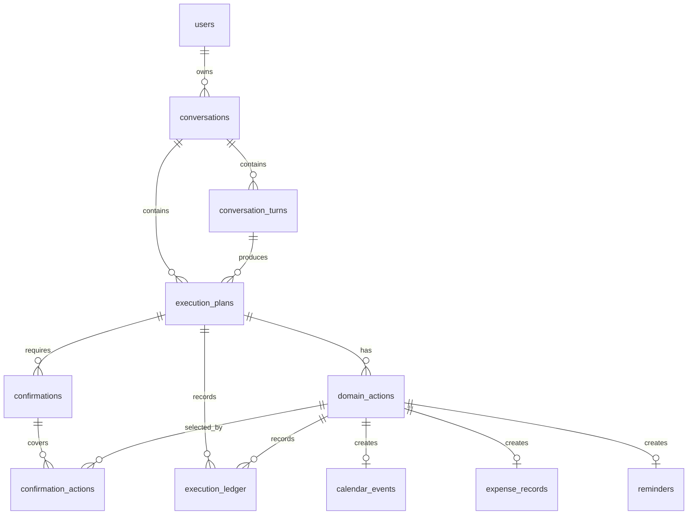

# Agent 执行工作流数据库设计

## 目标

为 AI 时间管理 Agent 的后端 Phase 1 提供第一版 Postgres 持久化模型，覆盖对话、执行计划、领域动作、确认卡片、执行审计和基础领域事实表。

当前运行时代码仍使用 in-process repository。本文定义的是迁移到 Postgres 时的目标结构，不要求一次性替换所有内存实现。

## 设计原则

- Agent runtime 只负责解析和规划，不直接写入领域事实表。
- 所有写操作必须先形成 `execution_plans` 和 `domain_actions`。
- 用户确认后，Orchestrator 调用领域 service；领域 service 校验 payload、权限、幂等键和业务不变量后写入领域事实表。
- `domain_actions` 是幂等执行单元，网络重试或重复确认不能重复创建日程、费用或提醒。
- `execution_ledger` 是 append-only 审计流，前端执行记录和后端调试都从这里读取。
- 领域事实表通过 `source_action_id` 追踪来源 action。取消、撤回和关闭优先更新 `status`，不做物理删除。
- API 当前使用字符串 ID，例如 `plan_xxx`、`action_xxx`、`calendar_event_xxx`，数据库第一版沿用 `text` 主键，避免迁移时破坏现有契约。

## 表分组

### 对话上下文

```text
users
conversations
conversation_turns
```

`users` 保存开发用户或未来账号用户的基础上下文。时间解析依赖 `timezone` 和 `locale`，因此即使 V1 使用匿名用户，也应保留这些字段。

`conversations` 表示一次连续工作台上下文，不等同于完整聊天归档。

`conversation_turns` 保存一次用户输入和助手响应摘要。默认保存结构化摘要；完整 raw content 作为 `jsonb` 可选字段，避免过早把聊天全文变成默认持久化负担。

### 执行工作流

```text
execution_plans
domain_actions
confirmations
confirmation_actions
execution_ledger
```

`execution_plans` 保存一次用户输入对应的计划状态、总体风险、摘要和 `decision_trace_id`。

`domain_actions` 保存计划下的领域动作。`payload` 和 `result` 使用 `jsonb`，并通过 `schema_version` 为后续结构演进留出口。

`confirmations` 保存确认卡片状态和确认 token 的 hash。数据库不保存明文 `confirmToken`。

`confirmation_actions` 表达确认卡片覆盖的 action 集合。不要把 action ID 数组直接塞进 `confirmations`，否则后续部分确认、过期、审计和权限判断会很难扩展。

`execution_ledger` 保存计划和 action 的执行事件。第一版包含 `before_snapshot`、`after_snapshot` 和 `error_code` 预留字段，便于后续调试、回放和失败分析。

`confirmation_actions` 和 `execution_ledger` 使用复合外键约束 `plan_id + action_id`，确保确认卡片或 ledger 不能引用另一个 plan 下的 action。

### 领域事实

```text
calendar_events
expense_records
reminders
```

`calendar_events` 是第一条真实执行链路。`source_action_id` 必须唯一，保证同一个创建 action 重试时不会重复写入日程。

`expense_records` 和 `reminders` 在 Phase 1 先作为可迁移边界存在。当前 API 可以先返回空数据，后续接入领域 service 时直接落到这些表。

## 状态约束

`execution_plans.status`：

```text
awaiting_confirmation
executing
succeeded
failed
rejected
expired
```

`domain_actions.status`：

```text
planned
awaiting_confirmation
executing
succeeded
failed
rejected
```

`confirmations.status`：

```text
pending
confirmed
rejected
expired
```

`execution_ledger.status`：

```text
info
succeeded
failed
```

领域状态：

```text
calendar_events.status: scheduled, canceled
expense_records.status: draft, submitted, canceled
reminders.status: scheduled, done, canceled
```

第一版 migration 使用 `check` constraint，而不是 Postgres enum。这样后续新增状态时可以用普通迁移调整约束，不需要处理 enum 删除或回滚的麻烦。

## 关键关系



## 索引策略

- `conversation_turns(conversation_id, created_at)` 支持按会话读取上下文。
- `execution_plans(conversation_id, created_at)` 支持会话下展示计划历史。
- `execution_plans(status)` 支持后台扫描超时确认或失败计划。
- `domain_actions(plan_id, status)` 支持确认和执行时读取待处理 action。
- `execution_ledger(plan_id, created_at)` 支持前端执行记录。
- `calendar_events(start_at)` 支持日历视图范围查询。
- `expense_records(status)` 支持费用草稿列表。
- `reminders(status, due_at)` 支持提醒队列。

## 后续迁移顺序

1. 保留当前 in-memory repository，先把 migration 纳入仓库。
2. 引入数据库连接配置和 migration 执行命令。
3. 抽象 `ExecutionStore` 和 `CalendarEventRepository` 接口。
4. 新增 Postgres repository，并用集成测试覆盖 confirm/retry/idempotency。
5. 将 `execution_plans`、`domain_actions`、`confirmations`、`execution_ledger` 和 `calendar_events` 切到 Postgres。
6. 再实现 `expense_records` 和 `reminders` 的领域 service。
